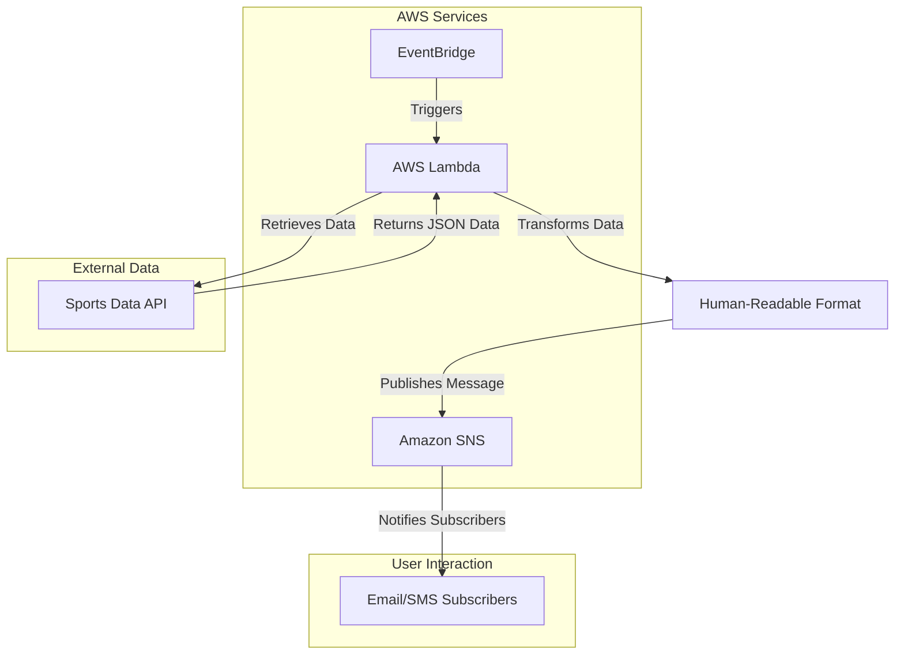

# Game Day Notification Solution

## Introduction
The **Game Day Notification Solution** provides timely updates on NBA games through SMS and email notifications. Using an event-driven architecture, the application automatically sends notifications every few hours or at the end of the day, including final scores and relevant game information.  It leverages a free Sports Data API to retrieve game data and AWS services for efficient processing and delivery.

## Project Overview
- **Goal**: Develop a notification app that alerts users about NBA games.
- **Frequency**: Notifications will be sent every few hours or at the end of the day.
- **Data Source:**  [SportsDataIO](https://sportsdata.io/) (You can replace this with the API you choose).
- **Notification Method:**  Email and SMS using Amazon SNS.

## Architecture and Data Flow

The solution employs an event-driven architecture using the following AWS services:
- **AWS Lambda**: Executes code in response to API requests.
- **Amazon SNS (Simple Notification Service)**: Sends notifications to subscribers via email or SMS.
- **Amazon EventBridge**: Schedules tasks similar to Cron jobs to automate notifications.

### Workflow
 1. **Event Trigger**: Amazon EventBridge triggers the AWS Lambda function at scheduled intervals. 
 2. **Data Retrieval**: AWS Lambda queries the Sports Data API for game updates.
 3. **Data Processing**: The Lambda function processes the JSON response, extracts relevant game data, and formats it into human-readable messages.
 4. **Notification Publishing**: The Lambda function publishes the formatted messages to an Amazon SNS topic. 
 5. **Subscriber Delivery**: Amazon SNS handles the delivery of notifications to subscribers via email or SMS.

## Technology Stack
- **Programming Language**: Python
- **AWS Services**:
  - AWS Lambda
  - Amazon SNS
  - Amazon EventBridge

## Testing
Test the system by triggering the Lambda function manually or waiting for scheduled events, ensuring that notifications are received correctly via email or SMS.

## Conclusion
The Game Day Notification Solution aims to provide seamless updates on NBA games, utilizing AWS's robust infrastructure for scalability and reliability. This project not only enhances user engagement but also demonstrates effective use of cloud technologies in building automated notification systems.