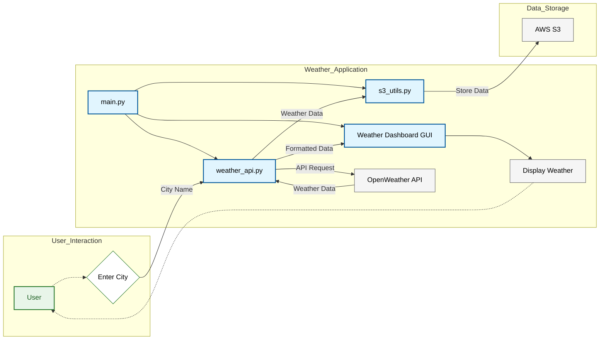

# Day 1: Weather Dashboard

## Overview

Today's challenge involved building a Python application that fetches real-time weather data from the OpenWeatherMap API and saves it to an AWS S3 bucket. I decided to create a simple graphical user interface (GUI) using Tkinter to make the application more user-friendly. 

## Features

- **Fetch Weather Data:** Retrieves current weather conditions for a specified city using the OpenWeatherMap API.
- **Display Weather Data:** Presents the fetched data in a clear and readable format within the GUI.
- **Save to S3 Bucket:** Stores the raw JSON data received from the API into an AWS S3 bucket for later analysis or use. 

## Technologies Used

- **Python:** The core programming language for the application.
- **Tkinter:** Used to create the graphical user interface. 
- **Requests:** For making HTTP requests to the OpenWeatherMap API.
- **Boto3:** The AWS SDK for Python, used to interact with S3.
- **dotenv:**  To load environment variables (API keys, bucket name) securely.


## Project Structure
```bash
weather-dashboard/
├── src/                 # Source code for the application
│   ├── __init__.py      # Makes src a package (can be empty)
│   ├── gui.py           # Tkinter GUI code
│   ├── weather_api.py   # Weather API interaction logic
│   └── s3_utils.py      # S3 bucket interaction logic
├── tests/               # Unit tests for the application
│   ├── __init__.py     
│   ├── test_gui.py
│   ├── test_weather_api.py
│   └── test_s3_utils.py
├── .gitignore           # Files/folders to exclude from Git
├── requirements.txt     # Project dependencies
├── README.md            # Project description and instructions
└── main.py              # Entry point of the application
```

## Architecture Diagram


## How to Run

1. **Prerequisites:**
   - **Python 3.7+:** Install from [https://www.python.org/](https://www.python.org/) 
   - **Libraries:** Install required packages: `pip install -r requirements.txt`
   - **OpenWeatherMap API Key:** Obtain an API key from [https://openweathermap.org/api](https://openweathermap.org/api)
   - **AWS Account:** Create an account on [https://aws.amazon.com/](https://aws.amazon.com/)
   - **S3 Bucket:** Create an S3 bucket in your preferred AWS region. 

2. **Configuration:**
   - Create a `.env` file in the project's root directory.
   - Add your API key and bucket name to the `.env` file (see example below): 

     ```
     OPENWEATHER_API_KEY=your_actual_api_key_here
     AWS_BUCKET_NAME=your_bucket_name 
     ```

3. **Run the application:**
   ```bash
   python main.py
    ```

## Issues and Troubleshooting

This section outlines some common issues I have encountered while setting up or running the weather dashboard application and provides solutions or workarounds.

**1. "IllegalLocationConstraintException" when Creating S3 Bucket:**

   **Problem:** You might encounter the error "An error occurred (IllegalLocationConstraintException) when calling the CreateBucket operation" if you haven't specified a region for your S3 bucket or if the default region setting is incompatible. 

   **Solution:**
   - **Specify Region in `s3_utils.py`:** 
     Ensure you've set the correct AWS region in the `S3Handler` class within `src/s3_utils.py`. Replace `"your-aws-region"` with your desired region (e.g., `"us-east-1"`, `"ap-south-1"`):

     ```python
     self.region_name = 'your-aws-region'
     self.s3 = boto3.client('s3', region_name=self.region_name)
     ```
   - **Configure Default AWS Region:**  For convenience, set your desired region as the default in your AWS CLI or Python environment to avoid specifying it repeatedly.

**2. "NoSuchBucket" Error when Saving Data:**

   **Problem:** The error "An error occurred (NoSuchBucket) when calling the PutObject operation" usually means the S3 bucket you're attempting to save data to doesn't exist.

   **Solution:**
   - **Verify Bucket Name:** Double-check that the bucket name in your code (`self.bucket_name`) matches the name of the bucket you created in S3. Remember that bucket names are globally unique.
   - **Confirm Bucket Creation:** Make sure the code to create the bucket (`create_bucket_if_not_exists`) runs successfully before attempting to save data.

This "Issues and Troubleshooting" section provides a starting point for addressing common problems. If you encounter issues not listed here, refer to the AWS documentation, online forums, or contact the project maintainers for further assistance.

## Project Snippets


