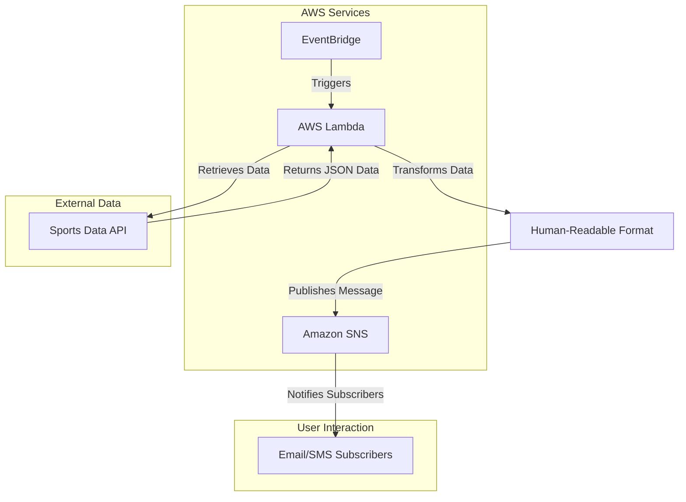

# Game Day Notification Solution

## Introduction
The **Game Day Notification Solution** is designed to provide timely updates on NBA games through SMS and email notifications. Utilizing an event-driven architecture, this application will automatically send notifications every 2-3 hours or at the end of the day, including final scores and relevant game information. The system interacts with a free API to retrieve game data, leveraging the capabilities of AWS services for efficient processing and delivery.

## Project Overview
- **Goal**: Develop a notification app that alerts users about NBA games.
- **Frequency**: Notifications will be sent every few hours or at the end of the day.
- **Data Source**: The application will query a free Sports Data API to gather information on NBA games.

## Architecture and Data Flow

The solution employs an event-driven architecture using the following AWS services:
- **AWS Lambda**: Executes code in response to API requests.
- **Amazon SNS (Simple Notification Service)**: Sends notifications to subscribers via email or SMS.
- **Amazon EventBridge**: Schedules tasks similar to Cron jobs to automate notifications.

### Workflow
1. **Data Retrieval**: AWS Lambda queries the Sports Data API for game updates.
2. **Data Transformation**: The JSON response is formatted into a human-readable message.
3. **Notification Delivery**: The formatted message is published to an SNS topic, which notifies all subscribers.

## Technology Stack
- **Programming Language**: Python
- **AWS Services**:
  - AWS Lambda
  - Amazon SNS
  - Amazon EventBridge

## Setup Instructions
### Creating SNS Topic and Subscriptions
1. Navigate to the SNS service in the AWS Management Console.
2. Create a new topic and add subscribers (email addresses or phone numbers).
3. Confirm subscriptions via the link sent to subscriber emails.

### IAM Role and Policy for Lambda
1. Create a policy in IAM that allows the Lambda function to publish messages to the SNS topic.
2. Attach this policy to a role that will be used by the Lambda function.

### Configuring the Lambda Function
1. Create a new Lambda function using Python.
2. Obtain and store necessary environment variables (API key, SNS topic ARN).
3. Write code to handle API requests, process responses, and publish messages.

### Scheduling with EventBridge
1. Create a rule in EventBridge to invoke the Lambda function at specified intervals using a Cron expression.
2. Set up the schedule to run every 2 hours during specified times.

## Testing
Test the system by triggering the Lambda function manually or waiting for scheduled events, ensuring that notifications are received correctly via email or SMS.

## Conclusion
The Game Day Notification Solution aims to provide seamless updates on NBA games, utilizing AWS's robust infrastructure for scalability and reliability. This project not only enhances user engagement but also demonstrates effective use of cloud technologies in building automated notification systems.