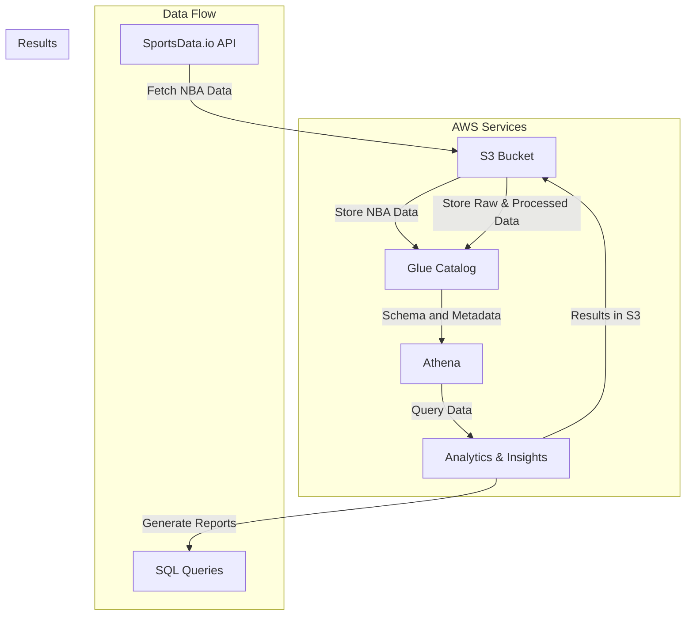

# Day 3: Building a Data Lake for NBA Analytics

## Overview

Today's challenge focuses on building a data lake on AWS to store and analyze NBA data. The data lake ingests data from a sports API, stores it in a scalable and cost-effective manner on S3, catalogs it using AWS Glue, and enables querying and analysis using Amazon Athena. 

## Objectives

- **Ingest data:** Fetch NBA data from a sports API (e.g., [SportsDataIO](https://sportsdata.io/)).
- **Store data:** Design an S3 bucket structure to house raw and processed data efficiently. 
- **Catalog data:** Use AWS Glue to create a data catalog for easy discovery and querying.
- **Query data:** Use Amazon Athena to run queries on the data for analysis.

## Architecture



## Implementation Details
- **Data Ingestion**:An AWS Lambda function is triggered (e.g., by EventBridge on a schedule) to fetch NBA data from the chosen API.The Lambda function processes the data and stores it as raw JSON files in an S3 bucket (e.g., s3://your-bucket-name/raw-data/).
- **Data Storage (S3)**:An S3 bucket is set up to store the NBA data.A directory structure is created within the bucket to organize data based on source, date, and processing level (raw, processed):
```bash
s3://your-bucket-name/
├── raw-data/
│   └── nba/
│       └── year=2024/
│           └── month=10/
│               └── day=26/
│                   └── data.json 
└── processed-data/
    └── ...
```
- **Data Catalog (AWS Glue)**:AWS Glue crawlers are used to automatically discover and catalog the data stored in S3.A Glue database is created to represent the NBA data.Glue tables are defined, mapping the schema of the data to columns that can be queried.
- **Querying and Analysis (Amazon Athena)**:Amazon Athena is used to query the NBA data directly in S3 using standard SQL.You can run ad hoc queries or create visualizations using tools like Amazon QuickSight.

## Technology Stack
- Programming Language: Python
- AWS Services:
    - AWS Lambda
    - Amazon SNS
    - Amazon EventBridge

## Testing
Test the system by triggering the Lambda function manually or waiting for scheduled events, ensuring that notifications are received correctly via email or SMS.

## Conclusion
The Game Day Notification Solution aims to provide seamless updates on NBA games, utilizing AWS's robust infrastructure for scalability and reliability. This project not only enhances user engagement but also demonstrates effective use of cloud technologies in building automated notification systems